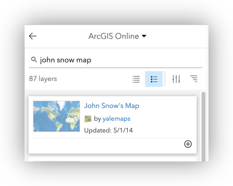

# ArcGIS Online 101

## Overview

This workshop aims to accomplish two things: Introduce participants to basic vocabulary, concepts and techniques for working with spatial data in research and introduce the interface and tools in ArcGIS Online, a web-based alternative to desktop GIS software. This introductory session will focus upon the fundamental concepts and skills needed to begin using ArcGIS Online for the exploration and analysis of spatial data.  

Topics will include:  

* How Webmaps work
* The ArcGIS Online User Interface
* Uploading data to AGO
* Using Web Map services in AGO
* Simple Analysis using spatial allocation and joins
* Using ArcGIS Online to create data
* Creating and sharing custom applications with ArcGIS Online

GIS Resources:
Stanford's ArcGIS Online Organization Login - [https://stanford.maps.arcgis.com](https://stanford.maps.arcgis.com/sharing/rest/oauth2/authorize?client_id=arcgisonline&display=default&response_type=token&state=%7B"returnUrl"%3A"https%3A%2F%2Fstanford.maps.arcgis.com%2Fhome%2Findex.html"%2C"useLandingPage"%3Atrue%7D&expiration=20160&locale=en&redirect_uri=https%3A%2F%2Fstanford.maps.arcgis.com%2Fhome%2Faccountswitcher-callback.html&force_login=true&hideCancel=true&showSignupOption=true&signuptype=esri)

Stanford Geospatial Center website - [http://gis.stanford.edu/](http://gis.stanford.edu/)

Stanford GIS Listserv - [https://mailman.stanford.edu/mailman/listinfo/stanfordgis](https://mailman.stanford.edu/mailman/listinfo/stanfordgis)

## Setup

Users should prepare for this workshop by ensuring that they have an updated browser (preferably Chrome or Firefox) downloading the data to their local hard drive.

**Stanford Affiliates** should be able to access the Stanford University Library's enterprise supbscription to ArcGIS Online, using Stanford Single-SignOn with their SUNetID at: 

[https://stanford.maps.arcgis.com](https://stanford.maps.arcgis.com/sharing/rest/oauth2/authorize?client_id=arcgisonline&display=default&response_type=token&state=%7B"returnUrl"%3A"https%3A%2F%2Fstanford.maps.arcgis.com%2Fhome%2Findex.html"%2C"useLandingPage"%3Atrue%7D&expiration=20160&locale=en&redirect_uri=https%3A%2F%2Fstanford.maps.arcgis.com%2Fhome%2Faccountswitcher-callback.html&force_login=true&hideCancel=true&showSignupOption=true&signuptype=esri)

### Data

The data package for the workshop can be downloaded from [https://github.com/mapninja/ArcGIS-Online-101/archive/master.zip](https://github.com/mapninja/ArcGIS-Online-101/archive/master.zip)

The project data folder contains the following datasets:

* **deathAddresses.csv**  - this is a table latitude and longitude coordinates for addresses affected by the cholera outbreak. This table also contains the number of deaths at each address.  
* **Study_Area.shp** - This file is simply a rectangular feature that describes our area of interest.  


#### Additional Files
There is an extra backup data folder that contains versions of files that we will create during the workshop. These files are provided in case any of the steps can't be completed due to software errors or other problems. 

* **Water_Pumps.geojson** - this is a spatial data file containing the locations of all of the water pumps recorded in John Snow's original map of the cholera outbreak.

## Getting started on a project  

In this section we will cover starting a new ArcGIS Online project. We will create a new Web Map and go over the basic ArcGIS Online interface.

### Logging in

At Stanford, we use Single Sign-On to provide users with a familiar login experience, and remove "gatekeepers" from our student's access to ArcGIS Online. Anyone with a valid SUNetID can use it to log into ArcGIS Online and get started working with spatial data and analysis. 

To log into ArcGIS Online, using your Stanford credentials:  

1. Go to [https://stanford.maps.arcgis.com](https://stanford.maps.arcgis.com) anad click on the "Sign In" link at the top right.  

2. Click on the "Enterprise Login" button

3. Follow the familiar Stanford Dual Authentication procedure to login.


### Interface overview

Overview

#### The Basic Components of the ArcGIS Online Interface

The ArcGIS Online interface is made up of three basic components:

* **Tabs:**  
* **The Map**  
* **The Toolbar:**  
* **Details Panel**  

## The Map

At the top of the ArcGIS Online page, you will see a Tab Bar that has items for Home, Gallery, Map, Scene, etc... We're going to focus upon the basics of the Map in ArcGIS Online, for now. 


1. Click on the **Map** Tab link, at the top of the page, to switch to a new map view.

2. Note the graphic, below, that gives an overview of the basic Map interface in ArcGIS Online.


### Changing Basemap layers and adding your own

The first thing we will do is begin exploring some of the tools in ArcGIS Online by altering the initial view of our Map and changing the basemap. ArcGI Online provides a number of 

#### Explore Built-in basemaps

1. Click on the Basemap button at the top of the Table of Contents Panel, and select one of the provided basemap layers

2. Change the basemap a few times to explore the available basemaps.

#### Hack Stamen tiles as your basemap

1. Click on the **Add** Button at the top of the Table of Contents and Select the "**Add Layer from Web**" item.

2. Use the following settings to fill the Add Layer from Web Dialog Box:

| Setting | Value |
|-----------:|--------------------------------------------------------------------|
| Data Type: | A Tile Layer |
| URL: | ```http://tile.stamen.com/toner-lite/{level}/{col}/{row}@2x.png``` |
| Title: | Stamen Toner Light |
| Credits: | Stamen Design |
| Extent: | *optional* |  

The Stamen tiles service URL:   
```http://tile.stamen.com/toner-lite/{level}/{col}/{row}@2x.png```  

  
3. Click **Add Layer** to change your basemap layer to **Stamen Toner Lite**.  


### Searching and adding content from ArcGIS Online

#### Add the John Snow Map

1. Click on the **Add** Button at the top of the Table of Contents and Select the "**Search for Layers**" item.
  
2. Change the drop-down at the top of the search panel to **ArcGIS Online**
3. Type '**John Snow Map**' into the **Search for layers** box and hit **Enter**
4. One of the first search returns should be "**John Snow's Map**" by **yalemaps**. Click the PLUS SIGN at the bottom right of it's item panel to add it to your map.  
  

A scanned and georeferenced image of John Snow's cholera map should be added should be added to your to your map layout, and you should be zoomed to it's extent.

###Save your map

1. Close the **Search for Layers** panel
2. Click on the **Save Button** on the Toolbar
3. Use the following settings to save your map:  

| Setting | Value |
|----------------:|-------------------------------------------|
| Title: | 1854 Cholera Outbreak (*your email*) |
| Tags: | cholera, john snow, london |
| Summary: | John Snow's 1854 cholera outbreak mapping |
| Save in folder: | *use the default* |  

4. Click **Save Map**


### Uploading a shapefile

*Talk about the shapefile format*

*Zipping a shapefile for upload*

#### Upload Study Area Shapefile

1. Click on the **Add** Button at the top of the Table of Contents and Select the "**Add Layer from File**" item.
2. Click on **Choose File** and browse to the /data/ folder of your project, select the **Study_Area.zip** file and click Open.
3. Select the "Keep original features" option, and click **Import Layer**

#### Adjust Symbology

1. Click on the **OPTIONS** button, when the **Change Style** panel appears
2. Click on "Symbols" at the top of the next dialog
3. Select **No Color** for the **Fill**, then switch to **Outline**, select a color, set **Transparency** to 0% and set the **Line Width** to **2px** 
4. Click OK>OK>Done to commit the changes and get out of the Symbology dialog
5. Save your Map


### Create a data layer from an XY table

Often the data sets that you want to work with will not come as spatial data sets. In this step we will add a table of data that contains fields with the latitude and longitude coordinates of the deaths addresses we want to analyze.

1. Click on the **Home** button at the top left of the webpage and select **Content**
2. Click on the **Add Item** button and select **From computer**
3. Click on Choose File and browse to your /data/ folder of your project, select the **deathAddresses.csv** file and click Open
4. Give the file an appropriate name and tags.
5. Leave "Publish this file as a hosted layer..." option checked
6. Under **"Locate features by:"**, select **Coordinates**
7. Scroll through the Field Types table and set the **xcoord=Longitude** and **ycoord=Latitude**
8. Click **Add Item**  
  
9. Wait for the **Details** page for the layer to be prepared, then click on **Open in Map Viewer** at the top right of the page.

### Layer symbology  

As you have seen, when you add a new layer to a map in ArcGIS Online, you are usually prompted to change the symbology, immediately. In this case, ArcGIS Online recognizes that there are numeric fields in the data and assumes you want to map **Num_Cases** as **Counts and Amounts (Size)**

1. Click on the Options button for the **Counts and Amounts (Size)** symbology type.
2. In the resulting **Change style** panel, check the option to **Classify data** / **Using:Equal Interval with:3 classes**  
3. Click **OK>Done** to commit your changes
4. Save your map. 

### Viewing the Attributes & Statistics on a field  

1. Hover over the Death Addresses layer in the Table of Contents and select the **Attribute Table** button  to show the Attribute Table
2. Click on the header of the **Num_Cases** column and select **Statistics**
3. Examine the statistical snapshot of the **Num_Cases** variable, then click Close
4. Close the Attribute table


## Creating spatial data

### Digitize features from a georeferenced map

1. Save your map
2. Go to Home>Content,click on the **Create** button anad select **Feature layer**
3. Select **Build a layer** from the tabs on the left, select **Points** and click **CREATE**
4. Click on the "Point layer" text and change it to **Water Pumps**, click **Next**
5. Pan and zoom to the London, UK area to set the extent and click **Next**
6. Give the feature layer a Name, Tags, Summary and use the default folder.
7. Click Done  

8. Click the **Data** tab at the top right of the details page for the feature layer you just created
9. Click on **Fields** at the top right
10. Add a field called **"Label"** of Type:String
11. Click on **Overview** to return to the main details page for the layer
12. Click **Open in Map Viewer**

### Editing your Water Pumps layer

#### First make an editing template

1. Click on the **Change Style** button  for the Water Pumps layer
2. Click on the **Options** button for **Location(Single symbol)**, then on the **Symbols** link
3. Select one of the Blue symbols and set the size to **25px**
4. Click **OK>OK>DONE** to commit the changes
5. Click on the **Edit** button at the top of the Table  of Contents
6. Click on the **MANAGE** button, at the bottom of the **Add Features** panel, then click **SAVE CHANGES**
7. Click on **Edit** twice to commit the changes and exit the Editing panels

#### Add a point to your shapefile

1. Click on **Edit** button again to start an edit session
2. Hold down the Shift-key and drag a box around the upper left quarter of the John Snow map in your Data Frame to zoom to it.
3. Click on the **Water Pumps>New Feature Template** to select it and click on the water pump located at the corner of Market Place & Castle Street
4. In the resulting attribute pop-up, record the Label as "Oxford Market" and click **CLOSE**
5. Locate the pump on Marlborough News (due south), and place a point on it, recording it's label based upon the street it is on.  
6. Click on the Edit button at the top of the Table of Contents to end your editing session
7. Save your map


### Create an Editing App

1. Click on the **Share** tool on the Toolbar
2. Click on **Create a Web App**
3. Click on the **Edit** application's icon and then click the **Create Web App button**  

4. Fill any required information in the resulting **Create a New Web App** dialog and click **DONE**
5. In the resulting page, click on the **Options** tab at the top of the Configure panel and check the option to **Display Edit Toolbar**
6. Note other options and tabs in the Configure Panel

7. Click **Save**, then **Launch**, to open the Editing Application (in a new tab) you just created


### Use the App to Digitize all pumps (There are 13)  

1. Click on the **New Feature** template at the left and locate and place a new Water Pump
2. Click on the **Edit** link in the resulting pop-up window to add the Label value for the pump
3. Continue until all 13 of the **Water Pumps** in the map have been digitized. 
4. When you have finished, return to the Browser Tab that has the Config panel for your application
5. Click on the **Browser Back** button of your web browser until you have returned to the main Map we have been working with.
6. Zoom and pan the map to confirm that your Water Pump points are now part of this map, as well. 


### Labels

1. Click on the ellipsis (three dots) under the Layer Name for your Water Pumps and select **Create Labels**
2. Change the **Text:** drop-down to your **Label** field
3. Set the Label size:20 and give it a Halo.  


## Basic spatial data analysis

### Create Walking time Isochrones

1. Click on the **Analysis** button and then expand the **Use Proximity** toolset
2. Click on the **Create Drive-Time Areas** Tool  
3. Make sure that your **Water Pumps** layer is selected as the input layer
4. Change the **Measure** to **Walking Time** of **5 Minutes**
5. Change the **Areas from different points** option to **Split**
6. Click on the **Show credits** link to check the number of credits used by this operation.
7. Click on the **RUN ANALYSIS** button
8. Wait

1. Change the style of the resulting layer, using **Facility:Label** to create a **Types(Unique symbols)** symbology for the layer
2. Click **DONE** when finished with symbology changes


### Spatial Join (Point Aggregation)

1. Return to the **Analysis Tools** panel
2. Expand the **Summarize Data** toolset
3. Click on the **Join Features** tool  
4. Use the following settings and click **RUN ANALYSIS**:  

| Setting | Value |
|----------------:|-----------------------------------------|
| Target Layer: | Death Addresses |
| Join Layer: | Travel\_from\_Water\_Pumps... |
| Type of Join: | Spatial Relationship: Completely Within |
| Join Operation: | One to One |


### Summary Statistics

1. From the **Analysis Tools>** Select the **Summarize Within** tool
2. Use the following settings, and click **RUN ANALYSIS** after checking credit usage  

| Setting | Value |
|----------------:|---------------------------------------|
| Polygon Layer: | Study_Area |
| Summarize Layer: | Join\_Features\_to\_Death\_Addresses |
| Add Statistics: | Num_Cases:SUM,MAX,AVERAGE |
| Group by Field: | Facility: Label | 
| Options: | Add Percentages |  

Examine the results once the analysis has completed. Note that the **GroupBySummary** table will be added to the bottom of the Table of Contents.

### Basic Measures of Spatial Central Tendency

1. From the **Analysis Tools** panel, click on the **Summarize Data** toolset and and select the **Summarize Center and Dispersion** tool
2. Use the following settings, and click the **RUN ANALYSIS** after checking credit usage

| Setting | Value |
|---------------:|---------------------------------------------------------|
| Layer: | Death Addresses |
| Summary Types: | Central Feature;Mean Center; Median Center; Ellipse:1SD |
| Weight By: | Num_Cases |


